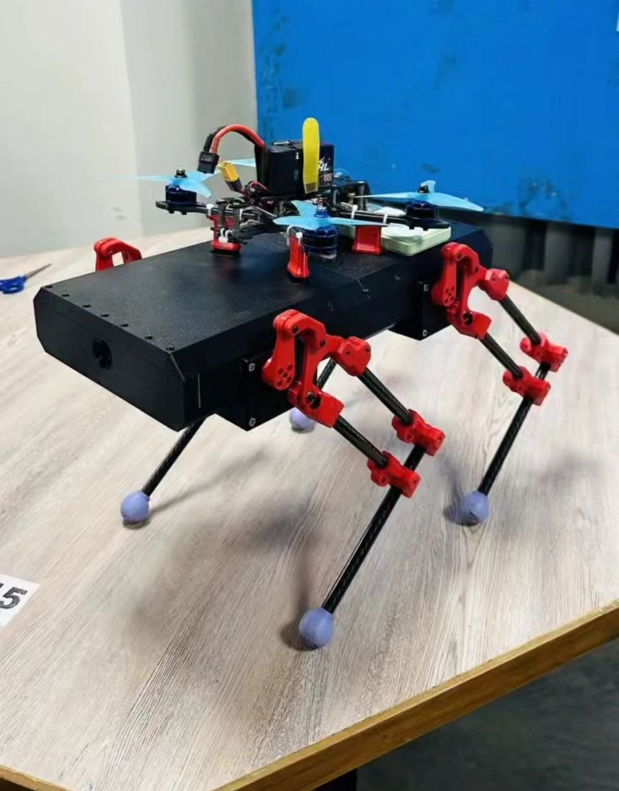

# Quadruped Control System

An embedded robotics platform for a 12-DOF quadruped "robot dog," focusing on low-latency procedural control, inverse kinematics (IK), and real-time stabilization using the ESP32 and Python.

## Tech Stack
- **Firmware:** C++/Arduino
- **Hardware Controller:** ESP32 C6 zero from waveshare
- **Actuators:** ST3215 Servos
- **Sensors:** ISM330DHCX (6-Axis IMU) for basic pitch stabilization 
- **Communication:** UDP over WiFi for low-latency control
- **Operator Interface:** Python-based XInput controller bridge or a radiomaster transmitter
- **DRONE Flight Controller:** Mico Air F405 mini
- **Flight controller firmware:** Ardupilot

##  Key Features
### Custom Inverse Kinematics (IK) Engine
- **3-DOF Solver:** Custom trigonometry-based IK solver for precise foot placement.
- **Dynamic Offsets:** Real-time adjustment for leg mounting orientation (sideways vs. vertical).

### Procedural Gait Trajectory
- **Square/Gait Trajectories:** Efficient point-to-point pathing for swing and stance phases.
- **Phase-Based Synchronization:** Uses a global phase variable to synchronize all four legs into a stable trot or walk.

### Active Stabilization (highly experimental logic)
- **IMU Feedback Loop:** Real-time pitch correction using signal from the ISM330DHCX.
- **Auto-Leveling:** Automatically adjusts leg height offsets based on body tilt to maintain a level chassis.

### Automated Sequences
- **Latching State Machine:** Execute complex maneuvers (e.g., "40-Step Walk to Crouch") triggered by a single controller pulse.

